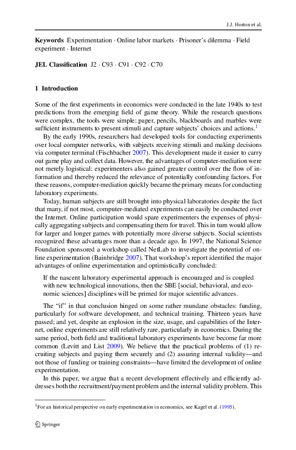
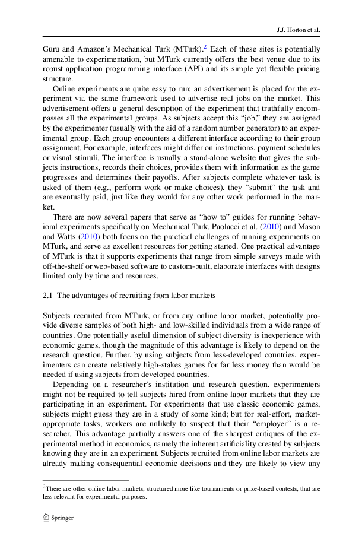

# Notes on: "The Online Laboratory" by Horton, Zeckhauser and Rand
### Page 1

### Text
    Exp Econ DOI 10.1007/s10683-011-9273-9  The online laboratory: conducting experi
    ments in a real labor market John J. Horton  David G. Rand  Richard J. Zeckhause
    r  Received: 28 June 2010 / Accepted: 11 January 2011  Economic Science Associat
    ion 2011  Abstract Online labor markets have great potential as platforms for co
    nducting experiments. They provide immediate access to a large and diverse subje
    ct pool, and allow researchers to control the experimental context. Online exper
    iments, we show, can be just as validboth internally and externallyas laboratory
     and field experiments, while often requiring far less money and time to design 
    and conduct. To demonstrate their value, we use an online labor market to replic
    ate three classic experiments. The first finds quantitative agreement between le
    vels of cooperation in a prisoners dilemma played online and in the physical lab
    oratory. The second shows consistent with behavior in the traditional laboratory
    that online subjects respond to priming by altering their choices. The third dem
    onstrates that when an identical decision is framed differently, individuals rev
    erse their choice, thus replicating a famed Tversky-Kahneman result. Then we con
    duct a field experiment showing that workers have upward-sloping labor supply cu
    rves. Finally, we analyze the challenges to online experiments, proposing method
    s to cope with the unique threats to validity in an online setting, and examinin
    g the conceptual issues surrounding the external validity of online results. We 
    conclude by presenting our views on the potential role that online experiments c
    an play within the social sciences, and then recommend software development prio
    rities and best practices. Thanks to Alex Breinin and Xiaoqi Zhu for excellent r
    esearch assistance. Thanks to Samuel Arbesman, Dana Chandler, Anna Dreber, Rezwa
    n Haque, Justin Keenan, Robin Yerkes Horton, Stephanie Hurder and Michael Manapa
    t for helpful comments, as well as to participants in the Online Experimentation
     Workshop hosted by Harvards Berkman Center for Internet and Society. Thanks to 
    Anna Dreber, Elizabeth Paci and Yochai Benkler for assistance running the physic
    al laboratory replication study, and to Sarah Hirschfeld-Sussman and Mark Edingt
    on for their help with surveying the Harvard Decision Science Laboratory subject
     pool. This research has been supported by the NSF-IGERT program Multidisciplina
    ry Program in Inequality and Social Policy at Harvard University (Grant No. 0333
    403), and DGR gratefully acknowledges financial support from the John Templeton 
    Foundations Foundational Questions in Evolutionary Biology Prize Fellowship. J.J
    . Horton  D.G. Rand  R.J. Zeckhauser ( Harvard University, Cambridge, USA e-mail
    : richard_zeckhauser@harvard.edu  )  

### Notes on page 1
### Page 2

### Text
    J.J. Horton et al.  Keywords Experimentation  Online labor markets  Prisoners di
    lemma  Field experiment  Internet JEL Classification J2  C93  C91  C92  C70  1 I
    ntroduction Some of the first experiments in economics were conducted in the lat
    e 1940s to test predictions from the emerging field of game theory. While the re
    search questions were complex, the tools were simple; paper, pencils, blackboard
    s and marbles were sufficient instruments to present stimuli and capture subject
    s choices and actions.1 By the early 1990s, researchers had developed tools for 
    conducting experiments over local computer networks, with subjects receiving sti
    muli and making decisions via computer terminal (Fischbacher 2007). This develop
    ment made it easier to carry out game play and collect data. However, the advant
    ages of computer-mediation were not merely logistical; experimenters also gained
     greater control over the flow of information and thereby reduced the relevance 
    of potentially confounding factors. For these reasons, computer-mediation quickl
    y became the primary means for conducting laboratory experiments. Today, human s
    ubjects are still brought into physical laboratories despite the fact that many,
     if not most, computer-mediated experiments can easily be conducted over the Int
    ernet. Online participation would spare experimenters the expenses of physically
     aggregating subjects and compensating them for travel. This in turn would allow
     for larger and longer games with potentially more diverse subjects. Social scie
    ntists recognized these advantages more than a decade ago. In 1997, the National
     Science Foundation sponsored a workshop called NetLab to investigate the potent
    ial of online experimentation (Bainbridge 2007). That workshops report identifie
    d the major advantages of online experimentation and optimistically concluded: I
    f the nascent laboratory experimental approach is encouraged and is coupled with
     new technological innovations, then the SBE [social, behavioral, and economic s
    ciences] disciplines will be primed for major scientific advances. The if in tha
    t conclusion hinged on some rather mundane obstacles: funding, particularly for 
    software development, and technical training. Thirteen years have passed; and ye
    t, despite an explosion in the size, usage, and capabilities of the Internet, on
    line experiments are still relatively rare, particularly in economics. During th
    e same period, both field and traditional laboratory experiments have become far
     more common (Levitt and List 2009). We believe that the practical problems of (
    1) recruiting subjects and paying them securely and (2) assuring internal validi
    tyand not those of funding or training constraintshave limited the development o
    f online experimentation. In this paper, we argue that a recent development effe
    ctively and efficiently addresses both the recruitment/payment problem and the i
    nternal validity problem. This 1 For an historical perspective on early experime
    ntation in economics, see Kagel et al. (1995).  

### Notes on page 2
### Page 3

### Text
    The online laboratory: conducting experiments in a real labor market  developmen
    t is the emergence of online labor markets. In these markets, workers from aroun
    d the world perform tasks amenable to remote completion, such as data entry, com
    puter programming, graphic design and clerical work (Frei 2009). These markets, 
    although designed for other purposes, make it possible to recruit large numbers 
    of subjects who are ready and able to participate in experiments. These recruite
    d subjects have the attractive properties of being diverse and not experiment-sa
    vvy. But their key characteristic is that they will participate in the experimen
    t within the context of an online labor market. This is critical, because the cr
    eators of online labor marketsfor their own, non-experimental purposes have buil
    t their platforms in a way that grants experimenters the control needed for vali
    d causal inference. In particular, the creators of these markets have made it ea
    sy to make individual-specific payments, screen out users who do not have valid 
    accounts with the market and prevent workers/subjects from communicating with ea
    ch other. Despite the benefits they offer, online experiments raise issues not f
    requently encountered in either the laboratory or the field. Just as television 
    shows are not filmed plays, online experiments are not simply laboratory experim
    ents conducted online. This paper identifies the major differences and pays clos
    e attention to the unique challenges of online experimentation. Despite the cave
    ats and potential pitfalls, the value of online experiments is demonstrated by o
    ur replications; we quickly, cheaply and easily reproduce a handful of experimen
    tal results known to have external validity. Given that online experiments work,
     at least for the cases we tried, the logical next question is why. Much of the 
    material that follows seeks to answer that question. In Sect. 2 we provide infor
    mation on online labor markets and discuss in broad terms how these markets allo
    w researchers to overcome the classic challenges to causal inference. We also di
    scuss the strengths and inherent limitations of the online laboratory. In Sect. 
    3, we successfully reproduce the qualitative characteristics of a series of clas
    sic experimental results, as well as discuss other examples of research making u
    se of these markets. These confirmations support our basic argument, but challen
    ges remain. In Sect. 4, we address the primary specific challenges of conducting
     experiments online, and provide tentative solutions to these challenges. In Sec
    t. 5 we discuss the external validity of online experimental results. In Sect. 6
    , we analyze different experimental designs that can be used online. In addition
     to creating exciting opportunities for research, online experiments also pose p
    articular ethical challenges. They are the subject of Sect. 7. We conclude in Se
    ct. 8 with our thoughts on the future of the online laboratory.  2 Overview of e
    xperimentation in online labor markets At present, the most useful online labor 
    markets, from an experimentation standpoint, are all-purpose labor markets where
     buyers contract with individual sellers (Horton 2010). Some of the larger marke
    ts in this category include oDesk, Freelancer, Elance,  

### Notes on page 3
### Page 4

### Text
    J.J. Horton et al.  Guru and Amazons Mechanical Turk (MTurk).2 Each of these sit
    es is potentially amenable to experimentation, but MTurk currently offers the be
    st venue due to its robust application programming interface (API) and its simpl
    e yet flexible pricing structure. Online experiments are quite easy to run: an a
    dvertisement is placed for the experiment via the same framework used to adverti
    se real jobs on the market. This advertisement offers a general description of t
    he experiment that truthfully encompasses all the experimental groups. As subjec
    ts accept this job, they are assigned by the experimenter (usually with the aid 
    of a random number generator) to an experimental group. Each group encounters a 
    different interface according to their group assignment. For example, interfaces
     might differ on instructions, payment schedules or visual stimuli. The interfac
    e is usually a stand-alone website that gives the subjects instructions, records
     their choices, provides them with information as the game progresses and determ
    ines their payoffs. After subjects complete whatever task is asked of them (e.g.
    , perform work or make choices), they submit the task and are eventually paid, j
    ust like they would for any other work performed in the market. There are now se
    veral papers that serve as how to guides for running behavioral experiments spec
    ifically on Mechanical Turk. Paolacci et al. (2010) and Mason and Watts (2010) b
    oth focus on the practical challenges of running experiments on MTurk, and serve
     as excellent resources for getting started. One practical advantage of MTurk is
     that it supports experiments that range from simple surveys made with off-the-s
    helf or web-based software to custom-built, elaborate interfaces with designs li
    mited only by time and resources. 2.1 The advantages of recruiting from labor ma
    rkets Subjects recruited from MTurk, or from any online labor market, potentiall
    y provide diverse samples of both high- and low-skilled individuals from a wide 
    range of countries. One potentially useful dimension of subject diversity is ine
    xperience with economic games, though the magnitude of this advantage is likely 
    to depend on the research question. Further, by using subjects from less-develop
    ed countries, experimenters can create relatively high-stakes games for far less
     money than would be needed if using subjects from developed countries. Dependin
    g on a researchers institution and research question, experimenters might not be
     required to tell subjects hired from online labor markets that they are partici
    pating in an experiment. For experiments that use classic economic games, subjec
    ts might guess they are in a study of some kind; but for real-effort, marketappr
    opriate tasks, workers are unlikely to suspect that their employer is a research
    er. This advantage partially answers one of the sharpest critiques of the experi
    mental method in economics, namely the inherent artificiality created by subject
    s knowing they are in an experiment. Subjects recruited from online labor market
    s are already making consequential economic decisions and they are likely to vie
    w any 2 There are other online labor markets, structured more like tournaments o
    r prize-based contests, that are  less relevant for experimental purposes.  

### Notes on page 4
### Page 5

### Text
    The online laboratory: conducting experiments in a real labor market  task or ga
    me using an economic frame of mind. Even in non-economic scenarios, lack of subj
    ect awareness is useful, as their uninformed state rules out experimenter effect
    s and John Henry effects.3 When subjects are aware they are in an experiment, th
    ey might try to learn about the conditions of experimental groups. Subjects in a
     less desirable treatment might be upset by their bad luck, which might affect t
    heir behaviors. Cook and Campbell (1979) call this demoralization. Furthermore, 
    even if subjects remain unaware of an experiment and of the nature of the treatm
    ent, agents of the experimenter might affect outcomes through their own initiati
    ve, such as by compensatory equalization (i.e., intervening to make the outcomes
     of the different groups more similar and hence fairer). In online experiments i
    n which subjects have no knowledge of the treatments received by others, the thr
    eat of demoralization is minimal, and since carrying out online experiments gene
    rally requires no human agent, unauthorized interventions like compensatory equa
    lization are unlikely. 2.2 Obtaining control and promoting trust Even though onl
    ine labor markets provide a pool of would-be subjects with some desirable charac
    teristics, having subjects alone is not sufficient for the conduct of an experim
    ent. Experimenters need to be able to uniquely identify these subjects, convey i
    nstructions, collect responses and make payments, while being confident that the
    ir intended actions are actually being implemented properly. Fortunately, many o
    f the primary concerns of would-be experimenters mirror the concerns of the crea
    tors and customers of online labor markets. Employers worry that workers with mu
    ltiple accounts might place phony bids or manipulate the reputation system by le
    aving phony feedback. Similarly, experimenters worry that a subject with multipl
    e accounts might participate in an experiment multiple times. The creators of on
    line labor markets do not want workers to communicate with each other, as that c
    ould lead to collusion. Experimenters also worry about workers discussing the de
    tails of experiments with each other and possibly colluding. Finally, both emplo
    yers and experimenters need ways to pay individuals precise amounts of money as 
    rewards for their actions and decisions. It is now easy to hire and pay workers 
    within the context of online labor markets, yet still quite difficult to do the 
    same online, but outside of these markets. The problem is not technological. The
     type and quality of communicationemail, instant messenger services, voice-over-
    IPdo not depend on whether the buyer and seller are working inside or outside th
    e online market, and banks have been transferring funds electronically for decad
    es. The problem is that it is difficult to create trust among strangers. Trust i
    s an issue not only for would-be trading partners, but also for would-be experim
    enters. The validity of economics experiments depends heavily upon trust, partic
    ularly subjects trust that the promulgated rules will be followed and that all s
    tated facts 3 Experimenter effects are created when subjects try to produce the 
    effect they believe the experimenters  expect; John Henry effects are created wh
    en subjects exert great effort because they treat the experiment like a competit
    ive contest.  

### Notes on page 5
### Page 6

### Text
    J.J. Horton et al.  about payment, the identities of other subjects, etc., are t
    rue. This need for trust provides a good reason to embed experiments in online l
    abor markets, because the creators of these markets have already taken a number 
    of steps to foster trust of employers. The issue of trust is so critical that we
     investigate it empirically (in Sect. 5.4) via a survey of subjects recruited fr
    om both MTurk and a subject pool used for traditional laboratory experiments. Al
    l major online labor markets use reputation systems to create lasting, publiclya
    vailable reputationsreputations that are sacrificed if either buyers or workers 
    behave unfairly (Resnick et al. 2000). The market creators proactively screen ou
    t undesired participants by taking steps, such as requiring a bank account or va
    lid credit card, before either buyer or seller is allowed to join. With persons 
    who have been accepted, the market creators actively manage memberships and susp
    end bad actors, creating a form of virtuous selection not found in traditional m
    arkets. One kind of bad actor is the non-human, automated script that fraudulent
    ly performs work. To combat this potential problem, all sites require would-be m
    embers to pass a CAPTCHA, or completely automated public Turing test to tell com
    puters and humans apart (von Ahn et al. 2003). At least on MTurk, there is some 
    danger of malicious users writing scripts that automatically accept and complete
     Human Intelligence Tasks, or HITs. However, these attempts are trivially easy t
    o detect for anything more complicated than a single yes/no question. Furthermor
    e, asking comprehension questions regarding the details of the experimental inst
    ructions, as well as recording the total time taken to complete the HIT, allows 
    experiments to distinguish automated responders from actual subjects. In our exp
    erience, jobs that allow workers to only complete one unit of work (which is alm
    ost always the case with experiments) do not attract the attention of scammers w
    riting scripts (because would-be scammers cannot amortize script-writing costs o
    ver a larger volume of work). With proper precautions, it is unlikely that compu
    ters would show up as subjects, or that any workers/subjects would believe they 
    were playing against a computer. While the Turing test form of trust is importan
    t, the mundane but perhaps more critical requirement is that workers/subjects tr
    ust that buyers/experimenters will actually follow the rules that they propose. 
    To encourage this form of trust, many online labor markets require buyers to pla
    ce funds in escrow, which prevents buyers from opportunistically refusing to pay
     after taking delivery of the workers output (which is often an easy-to-steal in
    formational good). In many online markets, there is some form of dispute arbitra
    tion, which encourages the belief that all parties are operating in the shadows 
    of an institution that could hold them accountable for their actions, further pr
    omoting trust. Perhaps unsurprisingly, survey evidence suggests that workers in 
    MTurk believe that their online bosses are as fair as employers in their home co
    untries (Horton 2011). 2.3 Limitations of online experiments Online experiments,
     like any experimental method, have limitations, even when conducted within onli
    ne labor markets. One of the most obvious is that only some types of experiments
     can be run. Surveys and one-shot pen and pencil-style economic games are extrem
    ely straightforward and therefore amenable. Repeated games are  

### Notes on page 6
### Page 7

### Text
    The online laboratory: conducting experiments in a real labor market  also possi
    ble given the proper software tools (see Suri and Watts 2011 as an example). How
    ever, designs that require the physical presence of participants are clearly imp
    ossible. For example, recording physiological responses like eye movement, the g
    alvanic skin response or blood flow to the brain cannot be done online; neither 
    can interventions which involve physically manipulating the subjects such as hav
    ing them touch hot versus cold objects, nor manipulating the subjects environmen
    t such as changing lighting levels or playing loud music. Face to face communica
    tion is also challenging, although potentially surmountable to some extent given
     the widespread adoption of webcams and other video-chat technologies. A further
     limitation is the difficulty of creating common knowledge among participants. I
    n the traditional lab, it is possible to read the instructions aloud, such that 
    participants know that everyone has received the same instructions. Online, the 
    best that can be done is to inform subjects that all participants receive the sa
    me instructions, but this cannot be verified by the subjects. On the other hand,
     it is possible to build engaging instructional materials and to conduct in-game
     tests of comprehension before allowing subjects to continue in an experiment, t
    hus making it more likely that all subjects do in fact possess common knowledge.
     At present there is also no easy way to answer questions that subjects may have
     about the instructions, though in principle experimenters could communicate wit
    h subjects through email, VoIP or chat. However, this kind of interaction is mor
    e complicated and burdensome than the immediate feedback that can be given in a 
    laboratory. This difficulty puts some limits on the complexity of experiments th
    at can be easily run on MTurk. One way to deal with this issue is to include com
    prehension questions that verify subjects understanding of the experiment, with 
    correct answers being a prerequisite for participation. Although many subjects m
    ight fail for complicated tasks, experiments can take advantage of the large num
    ber of potential participants on MTurk to continue recruiting until enough compr
    ehending subjects have accumulated. One potentially serious limitation to online
     experimentation is uncertainty about the precise identity of the experimental s
    ubjects. We discuss this problem at length in Sect. 4, but we admit that 100% co
    nfidence that the problem is ruled out is unrealistic. Even if we are certain th
    at each worker has one and only one account, it is possible that multiple worker
    s share the same account. Thus it is possible that different people will complet
    e different sections of a single study, or that several people will work togethe
    r to complete a single set of decisions. This raises various potential challenge
    s in terms of consistency of responses across sections, judging the effort inves
    ted by participants, and group versus individual decision-making (Kocher and Sut
    ter 2005). A partial solution is provided by online labor markets that map more 
    closely to traditional markets (like oDesk and Elance) and that provide more ela
    borate tools for verifying worker identities.  3 Experiments in the online labor
    atory This section discusses research conducted in the online laboratory, both b
    y ourselves and others. We conducted three laboratory experiments for this paper
    , one a direct  

### Notes on page 7
### Page 8

### Text
    J.J. Horton et al.  quantitative replication of an experiment we ran in the phys
    ical laboratory, and two qualitative replications of experiments with well-known
     and widely reproduced results. These studies provide evidence that subjects on 
    MTurk behave similarly to subjects in physical laboratories. These successful re
    plications suggest that online experiments can be an appropriate tool for explor
    ing human behavior, and merit a place in the experimentalists toolkit alongside 
    traditional offline methods, at least for certain research questions. Our first 
    experiment had subjects play a traditional one-shot prisoners dilemma game. We c
    onducted the experiment both on MTurk and in the physical laboratory. The experi
    mental design was the same, except that the MTurk payoffs were 10 times smaller 
    than the payoffs in the physical lab. We found no significant difference in the 
    level of cooperation between the two settings, providing a quantitative replicat
    ion of physical lab behavior using lower stakes on MTurk. In both settings, a su
    bstantial fraction of subjects displayed other-regarding preferences. Our second
     experiment had subjects play the same prisoners dilemma game, after having been
     randomly assigned to read different priming passages of religious or non-religi
    ous text. Here we demonstrated the well-established fact that stimuli unrelated 
    to monetary payoffs can nonetheless affect subjects decisions. In both the secon
    d and third experiments, subjects earned individualized payments based on their 
    choices and the choices of other workers with whom they were randomly matched re
    troactively. Our third experiment replicated a famed result in framing shown by 
    Tversky and Kahneman (1981). In accordance with numerous duplications in the lab
    oratory, we found that individuals are risk-averse in the domain of gains, and r
    isk-seeking in the domain of losses. Subjects were paid a fixed rate for partici
    pating. Beyond our laboratory experiments, we conducted a natural field experime
    nt in the sense of the taxonomy proposed by Harrison and List (2004). It looked 
    at the labor supply response to manipulations in the offered wage. This experime
    nt placed us in the role of the employer. This experimenter-as-employer research
     design is perhaps the most exciting development made possible by online labor m
    arkets. We recruited subjects to perform a simple transcription of a paragraph-s
    ized piece of text. After performing this initial task, subjects were offered th
    e opportunity to perform an additional transcription task in exchange for a rand
    omly determined wage. As expected, we found that workers labor supply curves slo
    pe upward. 3.1 Existing research Several studies using online subject pools have
     appeared recently, with computer scientists leading the way. They all used MTur
    k, primarily as a way to conduct user-studies and collect data suitable for the 
    training of machine learning algorithms (Sheng et al. 2008; Kittur et al. 2008; 
    Sorokin and Forsyth 2008). In a paper that bridges computer science and economic
    s, Mason and Watts (2009) showed that, although quality is not affected by price
    , output declines when wages are lowered. Among the several economics papers tha
    t used online labor markets, Chen and Horton (2010) measured the way MTurk worke
    rs respond to wage cuts. They found  

### Notes on page 8
### Page 9

### Text
    The online laboratory: conducting experiments in a real labor market  that unexp
    lained wage cuts decrease output, but that when the cuts were justified to worke
    rs, the former levels of output were maintained.4 In a separate paper using MTur
    k, Horton and Chilton (2010) explored whether a simple rational model can explai
    n worker output. While they found strong evidence that at least some workers are
     price-sensitive, they also found that a non-trivial fraction are target earners
    , that is, people who work to achieve certain income targets rather than respond
    ing solely to the offered wage. In a third study, Suri and Watts (2011) had MTur
    k subjects play the same repeated public goods game run in the physical laborato
    ry by Fehr et al. (2000). Their MTurk subjects quantitatively replicated the exp
    erimental findings from the physical lab, using an order of magnitude lower payo
    ffs. In a natural field experiment conducted on MTurk, Chandler and Kapelner (20
    10) subtly manipulated the meaning of the task and measured whether that change 
    affected uptake and work quality, both overall and conditional upon a workers ho
    me country. Their work illustrates the kinds of experiments that would be very d
    ifficult and costly to conduct in offline settings. In addition to conventional 
    academic papers, a number of researchers are conducting experiments on MTurk and
     posting results on their blogs. Gabriele Paolacci at the University of Venice w
    rites a blog called Experimental Turk which focuses on reproducing results from 
    experimental psychology.5 While MTurk is to date the mostly commonly used online
     labor market, others are emerging. For example, Pallais (2010) conducted a fiel
    d experiment on the online labor market oDesk, in which she invited a large numb
    er of workers to complete a data-entry task. She found that obtaining a first jo
    b and receiving a feedback score helped them obtain future work in the market. 3
    .2 Quantitative replication: social preferences A central theme in experimental 
    economics is the existence of social (or otherregarding) preferences (Andreoni 1
    990; Fehr and Schmidt 1999). Countless laboratory experiments have demonstrated 
    that many peoples behaviors are inconsistent with caring only about their own mo
    netary payoffs. (For a review, see Camerer 2003.) Here we quantitatively replica
    ted the existence and extent of other-regarding preferences in the online labora
    tory using MTurk. To compare pro-social behavior on MTurk to that which is obser
    ved in the physical laboratory (hereafter often referred to as offline), we used
     the prisoners dilemma (PD), the canonical game for studying altruistic cooperat
    ion (Axelrod and Hamilton 1981). We recruited 155 subjects on MTurk and 30 subje
    cts at Harvard University, using the same neutrally-framed instructions, incenti
    ve-compatible design and ex-post matching procedure. To be commensurate with sta
    ndard wages on MTurk, 4 There are a number of papers that have used the Internet
     as a test bed for field experimentation, primarily  as a way to study auctions 
    (Resnick et al. 2006; Lucking-Reiley 2000). 5 Although blogs are certainly not e
    quivalent to peer-reviewed journals, they do allow academics to quickly  communi
    cate results and receive feedback. For example, Rob Miller and Greg Little at th
    e MIT Computer Science and Artificial Intelligence Laboratory (CSAIL) host a blo
    g called Deneme that reports the results of experiments using TurKita Java libra
    ry developed by Little and others to perform iterative, complex tasks on MTurk (
    Little et al. 2009).  

### Notes on page 9
### Page 10

### Text
    J.J. Horton et al.  payoffs were an order of magnitude smaller on MTurk compared
     to the offline lab. MTurk participants received a $0.50 show-up fee, while offl
    ine subjects received a $5 show-up fee. Each subject was informed that he or she
     had been randomly assigned to interact with another participant.6 They were fur
    ther informed that both players would have a choice between two options, A or B,
     (where A represents cooperation and B represents defection) with the following 
    payoff structure:  MTurk:  A B  A B $0.70, $0.70 $0, $1.00 $1.00, $0 $0.30, $0.3
    0  Physical lab:  A B  A B $7, $7 $0, $10 $10, $0 $3, $3 (1)  Note that, regardl
    ess of the action of ones partner, choosing B maximizes ones payoff. MTurk worke
    rs were additionally given five comprehension questions regarding the payoff str
    ucture, allowing us to compare subjects who were paying close attention with tho
    se who were not.7 In a one-shot PD, rational self-interested players should alwa
    ys select B. Consistent with a wealth of previous laboratory studies (Camerer 20
    03), however, a substantial fraction of our subjects chose A, both offline (37%)
     and on MTurk (47%). The difference between offline and online cooperation was n
    ot statistically significant ( 2 test, p = 0.294), although this may have been i
    n part due to the relatively small offline sample size (N = 30). However, if we 
    restrict our attention to the N = 74 MTurk subjects who correctly answered all f
    ive comprehension questions, we find that 39% chose A, giving close quantitative
     agreement with the 37% of cooperating physical laboratory subjects ( 2 test, p 
    = 0.811). See Fig. 1. These results demonstrate the ability of MTurk to quantita
    tively reproduce behavior from the physical laboratory, and also emphasize the i
    mportance of using payoff comprehension questions in the context of MTurk. 3.3 Q
    ualitative replication: priming Priming is a common tool in the behavioral scien
    ces. In priming studies, stimuli unrelated to the decision task (and which do no
    t affect the monetary outcomes) can nonetheless significantly alter subjects beh
    aviors. Priming has attracted a great deal of attention in psychology, and, more
     recently, in experimental economics (Benjamin et al. 2010a). In our second expe
    riment, we demonstrated the power of priming effects on MTurk. 6 MTurk subjects 
    were matched exclusively with MTurk subjects, and offline subjects matched exclu
    sively  with offline subjects. 7 The comprehension questions were: (1) Which ear
    ns you more money: [You pick A, You pick B].  (2) Which earns the other person m
    ore money: [You pick A, You pick B]. (3) Which earns you more money: [Other pers
    on picks A, Other person picks B]. (4) Which earns the other person more money: 
    [Other person picks A, Other person pick B]. (5) If you pick B and the other pic
    ks A, what bonus will you receive?  

### Notes on page 10
### Page 11

### Text
    The online laboratory: conducting experiments in a real labor market Fig. 1 Coop
    eration level in a one-shot prisoners dilemma is similar amongst physical labora
    tory subjects, MTurk workers who correctly answered five payoff comprehension qu
    estions, and all MTurk workers. Error bars indicate standard error of the mean  
    To do so, we recruited 169 subjects to play a PD game. In addition to a $0.20 sh
    ow-up fee, subjects were further informed of the following payoff structure:  A 
    B  A B $1.20, $1.20 $0.40, $1.60 $1.60, $0.40 $0.80, $0.80  (2)  As in the previ
    ous PD, A represents cooperation and B represents defection. Subjects were rando
    mly assigned to either the religious prime group (N = 87) or a neutral prime gro
    up (N = 82). The religious prime group read a Christian religious passage about 
    the importance of charity (Mark 10:1723) before playing the PD. The neutral prim
    e group instead read a passage of equal length describing three species of fish 
    before playing the PD. Following the PD, each subject completed a demographic qu
    estionnaire reporting age, gender, country of residence and religious affiliatio
    n. The subjects also indicated whether they had ever had an experience which con
    vinced them of the existence of God (here called believers). Based on previous r
    esults using implicit primes with a non-student subject pool (Shariff and Norenz
    ayan 2007), we hypothesized that the religious prime would increase cooperation,
     but only among subjects who had an experience which convinced them of the exist
    ence of God. The results are portrayed in Fig. 2. We analyzed the data using log
    istic regression with robust standard errors, with PD decision as the dependent 
    variable (0 = defect, 1 = cooperate), and prime (0 = neutral, 1 = religious) and
     believer (0 = does not believe in God, 1 = believes in God) as independent vari
    ables, along with a prime  believer interaction term. We also included age, gend
    er (0 = female, 1 = male), country of residence (0 = non-U.S., 1 = U.S.) and rel
    igion (0 = non-Christian, 1 = Christian) as control variables. Consistent with o
    ur prediction, we found no significant main effect of prime (p = 0.274) or belie
    ver (p = 0.545), but a significant positive interaction between the two (coeff =
     1.836, p = 0.008). We also found a significant main effect of gender (coeff = 0
    .809, p = 0.028), indicating that women are more likely to cooperate, but no sig
    nificant effect of age (p = 0.744), U.S. residency (p = 0.806) or Christian reli
    gion (p = 0.472). We demonstrated that the religious prime significantly increas
    es cooperation in the PD, but only among subjects who had an experience which co
    nvinced them of the existence of God. These findings are of particular note give
    n the mixed results  

### Notes on page 11
### Page 12

### Text
    J.J. Horton et al. Fig. 2 Reading a religious passage significantly increases pr
    isoners dilemma cooperation among those who have had an experience that convince
    d them of the existence of God, but not among those who have not had such an exp
    erience. Error bars indicate standard error of the mean  of previous studies reg
    arding the effectiveness of implicit religious primes for promoting cooperation 
    (Benjamin et al. 2010b).8 We demonstrate that the principle of priming can be ob
    served with MTurk and that the effectiveness of the prime can vary systematicall
    y, depending on the characteristics of the reader. 3.4 Qualitative replication: 
    framing Traditional economic models assume that individuals are fully rational i
    n making decisionsthat people will always choose the option that maximizes their
     utility, which is wholly-defined in terms of outcomes. Therefore, decision-maki
    ng should be consistent, and an individual should make the same choice when face
    d with equivalent decision problems. However, as the watershed experiment of Tve
    rsky and Kahneman (1981) (hereafter TK) demonstrated, this is not the case. TK i
    ntroduced the concept of framing: that presenting two numerically equivalent sit
    uations with different language can lead to dramatic differences in stated prefe
    rences. In our current experiment, we replicated the framing effect demonstrated
     by TK on MTurk.9 In TKs canonical example, subjects read one of two hypothetica
    l scenarios. Half of the subjects were given the following Problem 1: Imagine th
    at the United States is preparing for the outbreak of an unusual Asian disease, 
    which is expected to kill 600 people. Two alternative programs to combat the dis
    ease have been proposed. Assume that the exact scientific estimates of the conse
    quences of the programs are as follows: If Program A is adopted, 200 people will
     be saved. If Program B is adopted, there is 1 3 probability that probability th
    at no people will be saved. 600 people will be saved and 2 3 8 Note that the pri
    me had a marginally significant negative effect on subjects who had not had an e
    xperience  which convinced them of the existence of God ( 2 test, p = 0.080). It
     is conceivable that some of these subjects were antagonized by a message wrappe
    d in religious language. The difference between the effect on believers and nonb
    elievers is highly significant, as indicated by the interaction term in the regr
    ession above (p = 0.008). The possible counterproductive effect on nonbelievers 
    may help explain the mixed results of previous studies. 9 This is the second rep
    lication of this result on MTurk. Gabriele Paolacci also performed this experime
    nt  and reported the results on his blog, http://experimentalturk.wordpress.com/
    2009/11/06/asian-disease.  

### Notes on page 12
### Page 13

### Text
    The online laboratory: conducting experiments in a real labor market  Which of t
    he two programs would you favor? The other half were given Problem 2 in which th
    e setup (the first three sentences) was identical but the programs were framed d
    ifferently: If Program A is adopted, 400 people will die. If Program B is adopte
    d, there is 1 2 3 probability that nobody will die, and 3 probability that 600 p
    eople will die. The two scenarios are numerically identical, but the subjects re
    sponded very differently. TK found that in Problem 1, where the scenario was fra
    med in terms of gains, subjects were risk-averse: 72% chose the certain Program 
    A over the risky Program B. However, in Problem 2, where the scenario was framed
     in terms of losses, 78% of subjects preferred Program B. Using these same promp
    ts, we recruited 213 subjects to see whether they would reproduce this preferenc
    e reversal on MTurk. We offered a participation fee of $0.40. We randomly assign
    ed subjects to a treatment upon arrival. Consistent with TKs results, we found t
    hat the majority of subjects preferred Program A in the domain of gains (N = 95:
     69% A, 31% B), while the opposite was true in the domain of losses (N = 118: 41
    % A, 59% B). The framing significantly affected, and in fact reversed, the patte
    rn of preferences stated by the subjects ( 2 test, p < 0.001). Thus, we successf
    ully replicated the principle of framing on MTurk. 3.5 Field experiment: labor s
    upply on the extensive margin Economic theory predicts that, under most circumst
    ances, increasing the price paid for labor will increase the supply of labor.10 
    In this experiment, we exogenously manipulated the payment offered to different 
    workers and then observed their labor supply. Because the sums involved were so 
    small, we are confident that income effects, at least as traditionally conceived
    , were inconsequential in this context. We found strong evidence that subjects a
    re more likely to work when wages are high. When subjects arrived at the experim
    ent, we explained that they would answer a series of demographic questions and t
    hen perform one paragraph-sized text transcription for a total of $0.30. They we
    re also told that they would have the opportunity to perform another transcripti
    on after the original transcription was completed. In addition to asking their a
    ge, gender and hours per week spent online doing tasks for money, we asked worke
    rs to identify their home countries and their primary reasons for participation 
    on MTurk. Because economic opportunities differ by country, we might expect that
     motivation and behavior would also differ by country (Chandler and Kapelner 201
    0). Figure 3 presents a mosaic plot showing the cross-tabulation results. We can
     see that most subjects, regardless of nationality, claimed to be motivated prim
    arily by money. Among those claiming some other motivation, those from India cla
    imed to want to learn new skills, while those from the United States claimed to 
    want to have fun. For the actual real-effort task, we asked subjects to copy ver
    batim the text displayed in a scanned image into a separate text box. The text a
    ppeared as an image 10 The exception is when the increased price changes total w
    ealth to such an extent that changed tastes  under the new scenario (i.e., incom
    e effects) might be more important than the pure substitution effect.  

### Notes on page 13
### Page 14

### Text
    J.J. Horton et al.  Fig. 3 Self-reported motivation for working on Amazon Mechan
    ical Turk (row) cross-tabulated with self-reported country (column) for 302 work
    ers/subjects  in order to prevent subjects from simply copying and pasting the t
    ext into the text box. The advantages of a text transcription task are that it (
    a) is tedious, (b) requires effort and attention and (c) has a clearly defined q
    uality measurenamely, the number of errors made by subjects (if the true text is
     known). We have found it useful to machine-translate the text into some languag
    e that is unlikely to be familiar, yet has no characters unavailable on the stan
    dard keyboards. Translating increases the error rate by ruling out the use of au
    tomated spell-checking, and it prevents subjects from finding the true text some
    where on the web. For this experiment, our text passages were paragraph-sized ch
    unks from Adam Smiths Theory of Moral Sentiments, machine-translated into Tagalo
    g, a language of the Philippines. In our experiment, after completing the survey
     and the first task, subjects were randomly assigned to one of four treatment gr
    oups and offered the chance to perform another transcription for p cents, where 
    p was equal to 1, 5, 15 or 25. As expected, workers receiving higher offers were
     more likely to accept. Table 1 shows that as the offered price increased, the f
    raction of subjects accepting the offer rose. The regression results are i = 0.0
    164  pi + 0.6051 Y 0.0024  0.0418  (3)  

### Notes on page 14
### Page 15

### Text
    The online laboratory: conducting experiments in a real labor market Table 1 Acc
    eptance of paragraph transcription task by offer amount  Amount  Offers  Offers 
     Percentage  (cents)  accepted  rejected  accepted  1  34  37  0.48  5  57  18  
    0.76  15  74  5  0.94  25  71  6  0.92  with R 2 = 0.13 and sample size N = 302,
     with pi = pi  1. This offsetting transformation makes the regression intercept 
    interpretable as the predicted mean offer uptake when p = 1. Of course, a linear
     probability model only applies over a limited range, as it ultimately predicts 
    uptake rates greater than 1. While we could use a general linear model, it makes
     more sense to tie the problem more closely to our theoretical model of how work
    ers make decisions. Presumably workers reservation wagesthe minimum amount they 
    are willing to accept to perform some taskhave some unknown distribution with cu
    mulative density function F . Workers will choose to accept offers to do more wo
    rk if the offered wages exceed their individual reservation wages. For a task ta
    king t seconds and paying pi cents, then yi = 1  {pi /t > i }, where i is the re
    servation wage. If we assume that F is the log-normal distribution, the distribu
    tion parameters that maximize the likelihood of observing our data are  = 0.113 
    and  = 1.981. Given the average completion time on the first paragraph, the medi
    an reservation wage is $0.14/hour. 3.6 Summary Each of these replication studies
     was completed on MTurk in fewer than 48 hours, with little effort required on o
    ur part. The cost was also far less than that of standard lab experiments, at an
     average cost of less than $1 per subject. However, even this low per-subject co
    st vastly understates the comparative efficiency of online experiments. We entir
    ely avoided both the costs associated with hiring full-time assistants and the c
    osts of maintaining a laboratory. We also avoided the high initial costs of sett
    ing up a laboratory. Of course, low costs would be irrelevant if the results wer
    e not informative. And yet, despite the low stakes and extreme anonymity of MTur
    k, the subjects behavior was consistent with findings from the standard laborato
    ry. The studies demonstrate the power of MTurk to quickly and cheaply give insig
    hts into human behavior using both traditional laboratory-style experiments and 
    field experiments.  4 Internal validity It is reassuring that our experiments ac
    hieved results consistent with those of physical laboratories, but we make an in
    dependent case for the internal validity of online experiments. Internal validit
    y requires that subjects are appropriately assigned  

### Notes on page 15
### Page 16

### Text
    J.J. Horton et al.  to groups, that selective attrition is ruled out, and that s
    ubjects are unable either to interact with or influence one another. Each of the
    se concerns is magnified in online settings, but fortunately there are measures 
    that can overcome or at least mitigate these challenges. 4.1 Unique and independ
    ent observations Because of the inherent anonymity of the Internet, would-be exp
    erimenters are rightly concerned that subjects might participate multiple times 
    in the same experiment. Fortunately, the creators of online labor markets have t
    heir own strong financial incentives to prevent users from having multiple accou
    nts (which would be needed for repeated participation), and all major markets us
    e some combination of terms-of-use agreements and technical approaches to preven
    t multiple accounts.11 Our experience to date indicates they have been successfu
    l. Though vigilant to the possibility, we have detected very low numbers of peop
    le with multiple accounts (detected via use of cookies or IP address logging), t
    hough we have heard anecdotes of a few technically savvy users defeating these f
    eatures. Our view is that multiple accounts surely exist, but that they are a ne
    gligible threat in most online labor markets and are likely to remain so. As in 
    any well-designed regulatory scheme, the steps taken by those who run the sites 
    in online labor markets and hence in online laboratoriesraise the price of prohi
    bited behavior. Rendering undesired behavior impossible is unrealistic, but it i
    s possible to make such behavior highly unlikely. Furthermore, the emergence of 
    online labor markets where subjects are non-anonymous and can easily be contacte
    d (such as oDesk, Elance and Freelancer) provide the researcher with options to 
    reduce the risks associated with less controlled sites like MTurk. 4.2 Appropria
    te assignment To be certain that a treatment is having a causal effect on some o
    utcome, subjects must be assigned to treatment and control groups in a way unrel
    ated to how they will react to a treatment. Randomization is intended to meet th
    is goal, but by chance even randomization can lead to experimental groups that d
    iffer systematically, particularly if subjects differ on characteristics strongl
    y correlated with the outcome. One approach to this problem is to include pre-tr
    eatment variables as regressors, despite randomization. Even better, if we have 
    complete control over assignment, as we do in the online laboratory, we can pree
    mptively avoid the pre-treatment differences problem by using a blocking design,
     where we stratify on factors that correlate strongly with outcomes. Such a desi
    gn creates similar groups on the basis of potentially important factors, and the
    n applies the treatments within each group. In online settings where subjects ar
    e recruited sequentially, we can in principle stratify subjects on any demograph
    ic characteristic we care to measure. In all of our 11 Some sites require worker
    s to install custom software; presumably this software can detect whether  multi
    ple copies of the software are being run on the same computer. Other sites charg
    e membership fees or flat fees for fund transfers, both of which raise the costs
     of keeping multiple accounts.  

### Notes on page 16
### Page 17

### Text
    The online laboratory: conducting experiments in a real labor market  experiment
    s, we stratify according to arrival time, given the strong relationship between 
    arrival time and demographic characteristics (driven by the global nature of onl
    ine labor pools). It is important that subjects be unaware of either the stratif
    ication or the randomization; they cannot know what treatment is next, lest it i
    nfluence their participation or behavior. In principle, online experimenters cou
    ld use more complicated blocking designs by adaptively allocating subjects on th
    e basis of responses to a pre-assignment demographic survey. 4.3 Coping with att
    rition Subjects might drop out of the alternative treatments in an experiment at
     rates that differ due to the nature of the treatments. For instance, an unpleas
    ant video prime might prompt dropouts that a neutral video would not. Selective 
    attrition leads to selection bias and thus poses a threat to valid inference in 
    online experiments. The problem is especially acute online because subjects can 
    potentially inspect a treatment before deciding whether to participate. Note tha
    t this type of balking is different from potential subjects viewing a descriptio
    n of the overall experiment and deciding not to participate. That is not a conce
    rn, as those people are exactly analogous to those who view an announcement for 
    an offline, traditional experiment but dont participate. Thus, if one treatment 
    imposes a greater burden than another, MTurk subjects are more likely to drop ou
    t selectively than their physical laboratory counterparts. The online laboratory
     has at least two ways to deal with selective attrition. The first (Method 1) de
    signs the experiment in such a way that selective attrition is highly unlikely a
    nd then shows that the data on arrivals is consistent with random attrition. The
     second (Method 2) drives down inference-relevant attrition to make it negligibl
    e. Method 1 requires the experimenter to establish the empirical fact that there
     is an approximate balance in collected covariates across the groups, and then t
    o establish the untestable assumption that there is no unobserved sorting that c
    ould be driving the results (that is, different kinds of subjects are dropping o
    ut of the two groups, but by chance the total amount of attrition is the same). 
    It is doubtful that Method 1 could be made effectively unless the experimenter h
    as convincing evidence from elsewhere that there are no treatment differences th
    at could lead to disparate attrition. In our experience, such evidence is unlike
    ly to be available: even small differences in download speed have led to noticea
    ble and significant attrition disparities. For most applications, Method 2 is su
    perior, though it comes at the cost of a more elaborate experimental design. In 
    our experience, the best way to eliminate attrition is to give subjects strong i
    ncentives to continue participating in the experiment after receiving their trea
    tment assignments. In the physical lab, subjects will forfeit their show-up fee 
    if they leave prematurely; this provides a strong incentive to stay. Online expe
    riments can capitalize on something similar if they employ an initial phaseident
    ical across treatments that hooks subjects into the experiment and ensures that 
    there is minimal attrition after the hook phase.12 For example, all subjects mig
    ht be asked to perform a rather 12 One way of making minimal precise is to emplo
    y extreme sensitivity analysis and show that even all  subjects selecting out ha
    d behaved contrary to the direction of the main effect, the results would still 
    hold.  

### Notes on page 17
### Page 18

### Text
    J.J. Horton et al.  tedious but well-paid transcription task first, before being
     randomized to the comparatively easy tasks in the treatment and control groups.
     The fee for the transcription task is forfeited if the whole experiment is not 
    completed. The experimenter then restricts the sample to subjects that persevere
     through the tedious first phase, which is the same for all subjects. This incre
    ases confidence that these subjects will remain for the following phase. In shor
    t, this approach has subjects invest personally in the study in a manner identic
    al across treatment groups. We then raise the price of attrition so that any dif
    ferences between treatments that might drive non-random attrition are overcome b
    y the incentives to comply.13 To use this hook strategy ethically, it is importa
    nt to let subjects know initially some of the details of the experiment. Subject
    s should always know approximately what they will be doing (with estimates of th
    e time required) and the minimum payment they will receive for doing it. We have
     found that by providing plenty of information at the outset and by using approp
    riate hooking tasks, we can consistently drive attrition to zero. 4.4 Stable uni
    t treatment value assumption The stable unit treatment value assumption (SUTVA) 
    requires that any individuals outcome depends only upon his or her treatment ass
    ignment, and not upon the treatment assignment or outcome of any other subject (
    Rubin 1974). This assumption is potentially violated if subjects can communicate
     with each other about their treatments, choices or experiences. Physical labora
    tory experiments can avoid SUTVA problems by conducting the full experiment in o
    ne large session and prohibiting talk during the experiment. In practice, physic
    al laboratory experiments often need to be conducted over several days to get a 
    sufficient sample. Subjects are told not to talk to future prospective subjects.
     However, the extent of compliance with that request is not clear. The SUTVA pro
    blem is both more and less challenging online than in physical laboratories. On 
    the downside, the accumulation of subjects over time is inevitable online. The c
    ounterbalancing pluses are that the subjects are widely geographically scattered
     and less likely to know each other, and that the total time from first to last 
    subject in the experiments is potentially more compressed compared to traditiona
    l field experiments, providing less time for interaction across subjects. Furthe
    rmore, SUTVA problems or their absence are likely to be known: unlike in laborat
    ory or field experiments, the natural mode of conversations about goings-on in t
    he market take place in publicly viewable discussion forums instead of in privat
    e encounters. On the MTurk discussion boards, workers can and do highlight HITs 
    that they have found particularly interesting or rewarding. Sometimes they discu
    ss the content of the tasks. This could skew the results of an experiment. Fortu
    nately, as an experimenter, it is easy to monitor these boards and periodically 
    search for mentions of relevant user names or details from the experiment. 13 Ph
    ysical laboratory experiments essentially create the same pattern of costs, impl
    ying incentives not to  quit. Much of the effort for participation comes from ar
    ranging a schedule and traveling to the lab.  

### Notes on page 18
### Page 19

### Text
    The online laboratory: conducting experiments in a real labor market  We have be
    en running experiments for well over a year, and occasionally search the chat ro
    oms for mention of our user name. On one occasion, subjects did discuss our task
    , but a quick email from us to the original poster led to the mention being take
    n down. As a practical matter, we advise running experiments quickly, keeping th
    em unremarkable and periodically checking any associated message boards for disc
    ussions of any experimental particulars.14 Warning or threatening subjects is no
    t recommended, as this would probably do little to deter collusion; while possib
    ly piquing curiosity and prompting discussion.  5 External validity As with all 
    of experimental social science, the external validity of results is of central i
    mportance in evaluating online experiments. In this section, we discuss differen
    t aspects of external validity, including subject representativeness and quantit
    ative versus qualitative generalizability. We also discuss the interpretation of
     differences between online and offline results, and present survey results comp
    aring online and offline subjects trust that they will be paid as described in t
    he experimental instructions. 5.1 Representativeness People who choose to partic
    ipate in social science experiments represent a small segment of the population.
     The same is true of people who work online. Just as the university students who
     make up the subjects in most physical laboratory experiments are highly selecte
    d compared to the U.S. population, so too are subjects in online experiments, al
    though along different demographic dimensions. The demographics of MTurk are in 
    flux, but surveys have found that U.S.-based workers are more likely to be young
    er and female, while non-U.S. workers are overwhelmingly from India and are more
     likely to be male (Ipeirotis 2010). However, even if subjects look like some po
    pulation of interest in terms of observable characteristics, some degree of self
    -selection of participation is unavoidable. As in the physical laboratory, and i
    n almost all empirical social science, issues related to selection and realism e
    xist online, but these issues do not undermine the usefulness of such research (
    Falk and Heckman 2009). 5.2 Estimates of changes versus estimates of levels Quan
    titative research in the social sciences generally takes one of two forms: it is
     either trying to estimate a level or a change. For levels research (for example
    , what is the infant mortality in the United States? Did the economy expand last
     quarter? How many people support candidate X?), only a representative sample ca
    n guarantee a credible answer. For example, if we disproportionately surveyed yo
    ung people, we could not assess Xs overall popularity. 14 It might also be possi
    ble to piggy-back experiments by working with existing market participants with 
     established, commercial reputationsan attractive option suggested to us by Dana
     Chandler.  

### Notes on page 19
### Page 20

### Text
    J.J. Horton et al.  For changes research (for example, does mercury cause autism
    ? Do angry individuals take more risks? Do wage reductions reduce output?), the 
    critical concern is the sign of the changes effect; the precise magnitude of the
     effect is often secondary. Once a phenomenon has been identified, changes resea
    rch might make levels research desirable to estimate magnitudes for the specific
     populations of interest. These two kinds of empirical research often use simila
    r methods and even the same data sources, but one suffers greatly when subject p
    ools are unrepresentative, the other much less so. Laboratory investigations are
     particularly helpful in changes research that seeks to identify phenomena or to
     elucidate causal mechanisms. Before we even have a well-formed theory to test, 
    we may want to run experiments simply to collect more data on phenomena. This ki
    nd of research requires an iterative process of generating hypotheses, testing t
    hem, examining the data and then discarding hypotheses. More tests then follow a
    nd so on. Because the search space is often large, numerous cycles are needed, w
    hich gives the online laboratory an advantage due to its low costs and speedy ac
    cretion of subjects.15 5.3 Interpreting differences between results from online 
    and physical laboratories We have found good agreement between our results and t
    hose obtained through traditional means. Nonetheless, there are likely to be mea
    surable differences between results in online and physical laboratory experiment
    s (Eckel and Wilson 2006). How should one interpret cross-domain differences, as
    suming they appear to be systematic and reproducible? First, systematic differen
    ces would create puzzles, which can lead to progress. In this sense, the online 
    laboratory can complement conventional methodsa point emphasized by Harrison and
     List (2004) in the context of comparing laboratory and field experiments. To gi
    ve an example, suppose that future experiments find that subjects donate less in
     an online dictator game than in person. This would tell us something interestin
    g and add to our knowledge. It would not mean that the Internet result is wrong,
     assuming that the game is set up properly. The situation is analogous to findin
    g cross-cultural differences in game play (Bohnet et al. 2008; Gneezy et al. 200
    9; Herrmann and Thni 2009). Such results increase our knowledge of the social wo
    rld; they are not cautionary tales about the desirability of restricting experim
    ental subjects to undergraduates at U.S. research universities. When the Interne
    t was small and few people spent much time online, perhaps it made sense to trea
    t cross-medium differences as an argument against utilizing evidence from online
     domains. Today, however, Internet-mediated social interactions are no longer a 
    strange experience, one familiar to only a tiny fraction of the population.16 15
     It also increases the danger of hypothesis miningtrying out many hypotheses and
     reporting those  that work, quite likely only by chance. 16 A recent New York T
    imes article, If Your Kids Are Awake, Theyre Probably Online, reported that  Ame
    rican kids spend an average of seven to eight hours per day online.  

### Notes on page 20
### Page 21

### Text
    The online laboratory: conducting experiments in a real labor market Fig. 4 Degr
    ee of stated trust in experimenter instructions regarding payoffs among MTurk wo
    rkers and subjects recruited from the Harvard Decision Sciences Laboratory  5.4 
    Comparison of beliefs of online and offline subjects In economic experiments, pa
    rticipants must believe that payoffs will be determined as the experimenter desc
    ribes. We wished to assess how MTurk workers compare to participants in traditio
    nal lab experiments in their level of experimenter trust. Thus, we conducted a s
    urvey receiving responses from 205 workers on MTurk and 192 members of the Harva
    rd Decision Sciences Laboratory subjects pool (a lab that prohibits deception).1
    7 Participants indicated the extent to which they trusted that they would be pai
    d as described in the instructions using a 7-point Likert scale, with 7 being th
    e maximum trust level. Responses are shown in Fig. 4. Although there is lower tr
    ust among MTurk workers, the mean level of trust is comparable and highest trust
     response was modal for both groups. The mean levels of trust were 5.41 for MTur
    k workers and 5.74 for lab subjects. The difference was 0.19 standard deviations
    , and represented only a modest difference in trust levels, though one that was 
    strongly statistically significant using a rank-rum test (p = 0.004). These surv
    ey results indicate that trust of experimenters is fairly high on average. The p
    hysical lab had more extreme subjectsvery trusting and very untrustingand fewer 
    in the middle.  6 Experimental designs Certain kinds of research designs work be
    tter than others online. One design that works well is the experimenter-as-emplo
    yer natural field experiment. For such experiments, the interaction is completel
    y unremarkable from the perspective of online subjects, who have no idea they ar
    e involved in an experiment. Of course, for this kind of experiment, the researc
    hers institutional review board (IRB) must waive the 17 MTurk subjects were paid
     $0.10 for responding; lab pool subjects received no payment.  

### Notes on page 21
### Page 22

### Text
    J.J. Horton et al.  need to obtain informed consent from subjects prior to parti
    cipation. Institutions vary in their requirements, but we are hopeful that board
    s will approve experimenter-asemployer studies where the task and payments fall 
    within the range of what normally occurs on the labor market, as they often do f
    or traditional, offline field experiments. Certain kinds of surveys also work we
    ll online, as we will discuss below. Laboratory-type games are certainly possibl
    e, but they have a number of limitations, as discussed above, some of which will
     likely be overcome by better software, while others will remain intractable due
     to the inherent nature of the Internet. 6.1 Experimenter-as-employer In many of
    fline field experiments, the researcher participates in the market as an employe
    r, either by creating a new firm or by piggy-backing on an existing firm and dir
    ecting its policies. Worker-subjects perform a real-effort task, such as stuffin
    g envelopes, picking fruit, planting trees, etc. The manipulation is usually of 
    such elements as the payment scheme, team composition or framing. The online env
    ironment makes it easy to conduct experiments involving such manipulations, so l
    ong as the task requires no physical presence. Fortunately, there are plenty of 
    tasks that meet this requirement, such as data entry, content creation and image
     labeling. Subjects are simply recruited from the existing market to perform a t
    ask, one equivalent to many tasks required by real employers. They are then rand
    omly assigned to groups. The objective might be to test the role of alternative 
    incentive schemes or to determine how payment affects quality of performance. De
    pending upon institutional review board requirements, the subjects might not nee
    d to be notified that the task is an experiment. For the actual online task, it 
    is obviously impossible to have workers perform something physical, yet certain 
    real-effort tasks are well-suited to online completion. We have used data entry 
    tasks (namely transcribing text from a document) and image labeling tasks. Both 
    are common tasks on MTurk, and are easily understood by workers. The advantage o
    f text transcription is that it has an unambiguous error metric if the true text
     is known. The advantage of labeling is that if subjects can decide how many lab
    els to produce, creating the variation in the output measure needed for many exp
    eriments. The paired survey represents a variant of the experimenter-as-employer
     paradigm. It is used when one wants to know how some feature of the way a quest
    ion is posed affects responses. While this kind of experiment is very simple, it
     can yield powerful conclusions. For example, some of Tversky and Kahnemans clas
    sic work on framing, which we replicated, used the paired-survey method to show 
    that people viewed objectively identical scenarios quite differently depending u
    pon whether a two-component outcome was framed to focus on the gain or loss comp
    onent. This simple survey design yielded an insight that has subsequently been s
    hown to be widespread and important. MTurk is ideal for this kind of research. 6
    .2 Laboratory-type games online Some of the most successful examples of experime
    ntal social science use simple interactive games, such as the trust game, the pr
    isoners dilemma and market games.  

### Notes on page 22
### Page 23

### Text
    The online laboratory: conducting experiments in a real labor market  Subject in
    teractions are easy to arrange in physical laboratory experiments, because all t
    he subjects play at once. In online labor markets, by contrast, subjects often a
    rrive at the experiment over the course of several hours or days, making subject
     interactions difficult. There are several solutions to the difficulty presently
     available and many more under development. When subjects are asynchronous, the 
    widely used strategy method (Selten 1967) players report what they would do in v
    arious hypothetical situationscan identify outcomes in interactive situations. T
    his was the method we employed when performing our own trust-game and ultimatum-
    game experiments (not yet published). There is some evidence that subjects play 
    hot games (those that do not use the strategy method) differently (Brandts and C
    harness 2000). Ideally, new software developments will allow for hot interactive
     games. If the reliability of the strategy method is accepted, implementation of
     online experiments is simple. The experimenter needs only to simulate play once
     all responses have been received. This method also has the advantage of giving 
    more data points. For example, in contrast to a hot ultimatum game where we can 
    only observe accept or reject responses from the second player, in the cold stra
    tegy-method game, we can see the subjects responses to several offers because th
    ey must answer the question Would you accept X? for several X values. The online
     laboratory allows for hot play if sufficiently large numbers of respondents can
     be matched up as they arrive. Experiments have shown that it is possible to get
     MTurk workers to wait around for another player.18 This kind of approach requir
    es that the experimenter establish some rules for payment if a match cannot be f
    ound in a suitable amount of time. Another approach is to pay workers to come ba
    ck to a website at a certain time to play the game. The great advantage of this 
    method is that it closely replicates the current laboratory experience. This met
    hod requires web-based interfaces for games. Work at MIT to develop Seaweed, a w
    eb-based experimental platform, represents a strong step in this direction (Chil
    ton et al. 2009). Building such platforms should be a top priority for the exper
    imental social science community.  7 Ethics and community The online laboratory 
    raises new ethical issues. However, it also creates opportunities for setting hi
    gher standards of evidence and for fostering greater collaboration among social 
    scientists, both in terms of sharing materials and in the adversarial collaborat
    ion of replication studies, which are now far easier to perform. 7.1 Ethical imp
    lications of moving towards a bench science Online experiments can now propel ce
    rtain subfields in the social sciences substantially toward bench science. It is
     now remarkably easy to design, launch and analyze 18 See this blog post report 
    of the experiment by Lydia Chilton: http://groups.csail.mit.edu/uid/  deneme/?p=
    483.  

### Notes on page 23
### Page 24

### Text
    J.J. Horton et al.  the results of an experiment. Conducting multiple experiment
    s per week for relatively small amounts of money is now feasible. While this is 
    an exciting and welcome development, in such an environment, a researcher could 
    turn out a stream of spuriously significant results by burying all that are nega
    tive. Even honest researchers can convince themselves of the flaws in their pilo
    ts and of the legitimacy of the subsequent experiments that happened to yield go
    od results.19 A significant advantage of online experiments is that they can be 
    run with little assistance from others. This creates the offsetting disadvantage
     of reducing critiques by others of procedures and results. Since there are no l
    ab technicians, no subjects who can be contacted and no logs on university-run s
    ervers, the temptation to cheat may be high. While few researchers would knowing
    ly falsify results, certain professional norms could raise the cost of bad behav
    ior, with the effect of both fostering honesty and dampening skepticism. The fir
    st norm should be to require machine-readable sharing of experimental materials,
     as well as of detailed instructions on set-up and process. Perhaps some institu
    tion, such as a professional organization or the National Science Foundation, co
    uld set up a library or clearinghouse for such materials. While most results wou
    ld probably not be checked by new experiments, requiring all experimenters to ma
    ke replication very easy would make all results contestable. This should help ma
    ke cheating an unprofitable and unpopular strategy. Another advantage of such a 
    norm is that it would reduce costly duplication of programming effort and design
    . As a current example, the open-source survey software Limesurvey allows resear
    chers to export their survey designs as stand-alone files. Researchers can simpl
    y download other peoples experimental materials and then deploy their own workin
    g versions of surveys/experiments. Within economics, a consensus is developing t
    o make all data and code publicly available. To adhere to and support this norm 
    is easy in online contexts, but online experimenters should go a step further. D
    atasets should be publicly available in the rawest form possible (that is, in th
    e format in which the experimental software collected the data), as should the a
    ssociated code that turned the raw data into the data set.20 The Internet makes 
    such sharing a low-cost chore, since the data are invariably generated in machin
    e-readable form. 7.2 Deception Experimental economics has a well-established eth
    ic against deceiving subjects, an ethic that provides significant positive exter
    nalities. Many experiments rely critically on subjects accepting instructions fr
    om experimenters at face value. Moreover, deception in money-staked economics ex
    periments could approach and even constitute 19 It is thus important that any fi
    nal paper describe the alternative formulations that were tried. Statistical  te
    sts should take alternatives tried into account when computing significance. 20 
    Often it is necessary to clean this data in different ways, such as by dropping 
    bad inputs, or adjusting  them to reflect the subjects obvious intent (e.g., if 
    a subject is asked to report in cents and reports .50, it might reasonable to in
    fer they meant 50 cents, not a half-cent). By making all trimming, dropping, res
    haping, etc., programmatic, it is easier for other researchers to identify why a
     replication failed, or what seemingly innocuous steps taken by the original res
    earcher drove the results.  

### Notes on page 24
### Page 25

### Text
    The online laboratory: conducting experiments in a real labor market  fraud. The
     arguments for maintaining this no-deception policy in online experiments are ev
    en stronger. Workers in online labor markets represent a common resource shared 
    by researchers around the globe. Once experiments reach a significant scale, pra
    cticing deception in these markets could pollute this shared resource by creatin
    g distrust. In the online world, reputations will be hard to build and maintain,
     since the experimenters user name will usually be the only thing the subject kn
    ows about the experimenter. Of course, economists will share the experimental sp
    ace with psychologists, sociologists and other social scientists who may not sha
    re the no deception norm. Probably little can be done to police other discipline
    s, but economists can take steps to highlight to their subjects that they adhere
     to the no-deception rule and to present arguments to others that deception is a
     threat to the usefulness of these markets. If online experiments become truly w
    idespread, we would expect some sites to prohibit deception, in part because the
    ir non-experimenting employers would also be hurt by distrust. Additional forms 
    of certification or enforcement processes are also likely to arise. 7.3 Software
     development The most helpful development in the short term would be better (and
     betterdocumented) tools. There are a number of software tools under active deve
    lopment that should make online experimentation far easier. The first goal shoul
    d probably be to port some variant of zTree to run on the Internet. The MIT init
    iative Seaweed is a nascent attempt at this goal, but it needs much more develop
    ment. Obviously some tools, such as those for complex games, will have to be cus
    tombuilt for individual experiments. Advances in software are required for games
     calling for simultaneous participation by two or more subjects. Such software i
    s already under development in multiple locales. However, the research community
     should, as much as possible, leverage existing open-source tools. For example, 
    many experiments simply require some kind of survey tool. The previously mention
    ed opensource project, Limesurvey, already offers an excellent interface, sophis
    ticated tools and, perhaps most importantly, a team of experienced and dedicated
     developers as well as a large, non-academic user base.  8 Conclusion We argue i
    n this paper that experiments conducted in online labor markets can be just as v
    alid as other kinds of experiments, while greatly reducing cost, time and inconv
    enience. Our replications of well-known experiments relied on MTurk, as MTurk is
     currently the most appropriate online labor market for experimentation. However
    , as other online labor markets mature and add their own application programming
     interfaces, it should be easier to conduct experiments in additional domains. I
    t might even be possible to recruit a panel of subjects to participate in a seri
    es of experiments. While MTurk workers remain anonymous, many other markets have
     the advantage of making it easier to learn about subjects/workers.  

### Notes on page 25
### Page 26

### Text
    J.J. Horton et al.  We have shown that it is possible to replicate, quickly and 
    inexpensively, findings from traditional, physical laboratory experiments in the
     online laboratory. We have also argued that experiments conducted in the contex
    t of online labor markets have internal validity and can have external validity.
     Lastly, we have proposed a number of new and desirable norms and practices that
     could enhance the usefulness and credibility of online experimentation. The fut
    ure appears bright for the online laboratory, and we predict thatas the NetLab w
    orkshop quotation in our introduction suggeststhe social sciences are primed for
     major scientific advances.  References Andreoni, J. (1990). Impure altruism and
     donations to public goods: a theory of warm-glow giving. The Economic Journal, 
    464477. Axelrod, R., & Hamilton, W. D. (1981). The evolution of cooperation. Sci
    ence, 211(4489), 1390. Bainbridge, W. S. (2007). The scientific research potenti
    al of virtual worlds. Science, 317(5837), 472. Benjamin, D. J., Choi, J. J., & S
    trickland, A. (2010a). Social identity and preferences. American Economic Review
     (forthcoming). Benjamin, D. J., Choi, J. J., Strickland, A., & Fisher, G. (2010
    b) Religious identity and economic behavior. Cornell University, Mimeo. Bohnet, 
    I., Greig, F., Herrmann, B., & Zeckhauser, R. (2008). Betrayal aversion: evidenc
    e from Brazil, China, Oman, Switzerland, Turkey, and the United States. American
     Economic Review, 98(1), 294 310. Brandts, J., & Charness, G. (2000). Hot vs. co
    ld: sequential responses and preference stability in experimental games. Experim
    ental Economics, 2(3), 227238. Camerer, C. (2003). Behavioral game theory: exper
    iments in strategic interaction. Princeton: Princeton University Press. Chandler
    , D., & Kapelner, A. (2010). Breaking monotony with meaning: motivation in crowd
    sourcing markets. University of Chicago, Mimeo. Chen, D., & Horton, J. (2010). T
    he wages of pay cuts: evidence from a field experiment. Harvard University, Mime
    o. Chilton, L. B., Sims, C. T., Goldman, M., Little, G., & Miller, R. C. (2009).
     Seaweed: a web application for designing economic games. In Proceedings of the 
    ACM SIGKDD workshop on human computation (pp. 3435). New York: ACM Press. Cook, 
    T. D., & Campbell, D. T. (1979). Quasi-experimentation. Boston: Houghton Mifflin
    . Eckel, C. C., & Wilson, R. K. (2006). Internet cautions: experimental games wi
    th Internet partners. Experimental Economics, 9(1), 5366. Falk, A., & Heckman, J
    . J. (2009). Lab experiments are a major source of knowledge in the social scien
    ces. Science, 326(5952), 535. Fehr, E., & Schmidt, K. M. (1999). A theory of fai
    rness, competition, and cooperation. Quarterly Journal of Economics, 114(3), 817
    868. Fehr, E., Schmidt, K. M., & Gchter, S. (2000). Cooperation and punishment i
    n public goods experiments. American Economic Review, 90(4), 980994. Fischbacher
    , U. (2007). z- tree: Zurich toolbox for ready-made economic experiments. Experi
    mental Economics, 10(2), 171178. Frei, B. (2009). Paid crowdsourcing: current st
    ate & progress toward mainstream business use. Produced by Smartsheet.com. Gneez
    y, U., Leonard, K. L., & List, J. A. (2009). Gender differences in competition: 
    evidence from a matrilineal and a patriarchal society. Econometrica, 77(5), 1637
    1664. Harrison, G. W., & List, J. A. (2004). Field experiments. Journal of Econo
    mic Literature, 42(4), 1009 1055. Herrmann, B., & Thni, C. (2009). Measuring con
    ditional cooperation: a replication study in Russia. Experimental Economics, 12(
    1), 8792. Horton, J. (2010). Online labor markets. In Workshop on Internet and n
    etwork economics (pp. 515522). Horton, J. (2011). The condition of the Turking c
    lass: are online employers fair and honest? Economic Letters (forthcoming).  

### Notes on page 26
### Page 27

### Text
    The online laboratory: conducting experiments in a real labor market Horton, J. 
    & Chilton, L. (2010). The labor economics of paid crowdsourcing. In Proceedings 
    of the 11th ACM conference on electronic commerce. Ipeirotis, P. (2010). Demogra
    phics of Mechanical Turk. New York University Working Paper. Kagel, J. H., Roth,
     A. E., & Hey, J. D. (1995). The handbook of experimental economics. Princeton: 
    Princeton University Press. Kittur, A., Chi, E. H., & Suh, B. (2008). Crowdsourc
    ing user studies with Mechanical Turk. Kocher, M. G., & Sutter, M. (2005). The d
    ecision maker matters: individual versus group behaviour in experimental beauty-
    contest games*. The Economic Journal, 115(500), 200223. Levitt, S. D., & List, J
    . A. (2009). Field experiments in economics: the past, the present, and the futu
    re. European Economic Review, 53(1), 118. Little, G., Chilton, L. B., Goldman, M
    ., & Miller, R. C. (2009). TurKit: tools for iterative tasks on Mechanical Turk.
     In Proceedings of the ACM SIGKDD workshop on human computation. New York: ACM P
    ress. Lucking-Reiley, D. (2000). Auctions on the Internet: whats being auctioned
    , and how? The Journal of Industrial Economics, 48(3), 227252. Mason, W., & Watt
    s, D. J. (2009). Financial incentives and the performance of crowds. In Proceedi
    ngs of the ACM SIGKDD workshop on human computation (pp. 7785). New York: ACM Pr
    ess. Mason, W., Watts, D. J., & Suri, S. (2010). Conducting behavioral research 
    on Amazons Mechanical Turk. SSRN eLibrary. Pallais, A. (2010). Inefficient hirin
    g in entry-level labor markets. Paolacci, G., Chandler, J., & Ipeirotis, P. G. (
    2010). Running experiments on Amazon Mechanical Turk. Judgment and Decision Maki
    ng, 5. Resnick, P., Kuwabara, K., Zeckhauser, R., & Friedman, E. (2000). Reputat
    ion systems. Communications of the ACM, 43(12), 4548. Resnick, P., Zeckhauser, R
    ., Swanson, J., & Lockwood, K. (2006). The value of reputation on eBay: a contro
    lled experiment. Experimental Economics, 9(2), 79101. Rubin, D. B. (1974). Estim
    ating causal effects of treatments in randomized and nonrandomized studies. Jour
    nal of Educational Psychology, 66(5), 688701. Selten, R. (1967). Die Strategieme
    thode zur Erforschung des eingeschrankt rationalen Verhaltens im Rahmen eines Ol
    igopolexperiments. Beitrage zur experimentellen Wirtschaftsforschung, 1, 136168.
     Shariff, A. F., & Norenzayan, A. (2007). God is watching you. Psychological Sci
    ence, 18(9), 803809. Sheng, V. S., Provost, F., & Ipeirotis, P. G. (2008). Get a
    nother label? Improving data quality and data mining using multiple, noisy label
    ers. In Proceeding of the 14th ACM SIGKDD international conference on knowledge 
    discovery and data mining (pp. 614622). New York: ACM Press. Sorokin, A., & Fors
    yth, D. (2008). Utility data annotation with Amazon Mechanical Turk. University 
    of Illinois at Urbana-Champaign, Mimeo, 51, 61820. Suri, S., & Watts, D. (2011).
     A study of cooperation and contagion in web-based, networked public goods exper
    iments. PLoS ONE (forthcoming). Tversky, A., & Kahneman, D. (1981). The framing 
    of decisions and the psychology of choice. Science, 211(4481), 453. von Ahn, L.,
     Blum, M., Hopper, N. J., & Langford, J. (2003). CAPTCHA: using hard AI problems
     for security. In Lecture notes in computer science (pp. 294311). Berlin: Spring
    er.  

### Notes on page 27
